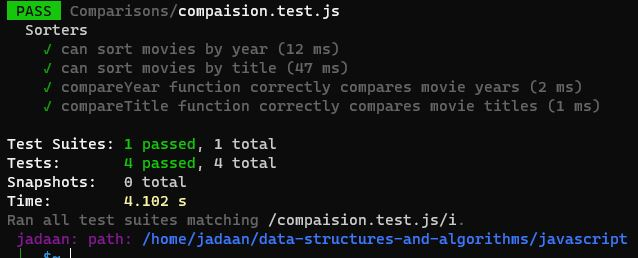

# Comparisons (Movie-Sort)

## Step 1: Understanding the Problem
We are given an array of Movie objects and need to write functions to sort these objects based on specific criteria.

## Step 2: Sorting by Most Recent Year First
To sort the movies by the most recent year first, we compare the `year` property of each movie. We use the `sort` method on the movies array and provide a callback function as an argument. This callback function takes two movies, `a` and `b`, and compares their years. We subtract `b.year` from `a.year` to get a positive or negative number. If the result is negative, it means `a` should come before `b` in the sorted array. If the result is positive, it means `b` should come before `a`. The `sort` method uses this comparison to rearrange the movies accordingly.

Here's an example of sorting movies by most recent year:
```javascript
> movies.sort((a, b) => b.year - a.year);
 ``````

 
## Step 3: Sorting Alphabetically by Title (Ignoring "A", "An", "The") To sort the movies alphabetically by title, but ignoring certain words like "A", "An", or "The" at the beginning of the title, we follow these steps:

* We define an array called ignoredWords containing the words we want to ignore.
* We use the sort method on the movies array and provide a callback function as an argument. This callback function takes two movies, a and b.
* Inside the callback function, we define a helper function called removeIgnoredWords which removes the ignored words from the title.
* We compare the modified titles (without the ignored words) using the localeCompare method, which handles the alphabetical comparison based on the user's language and syntax rules.

 ### test 
 