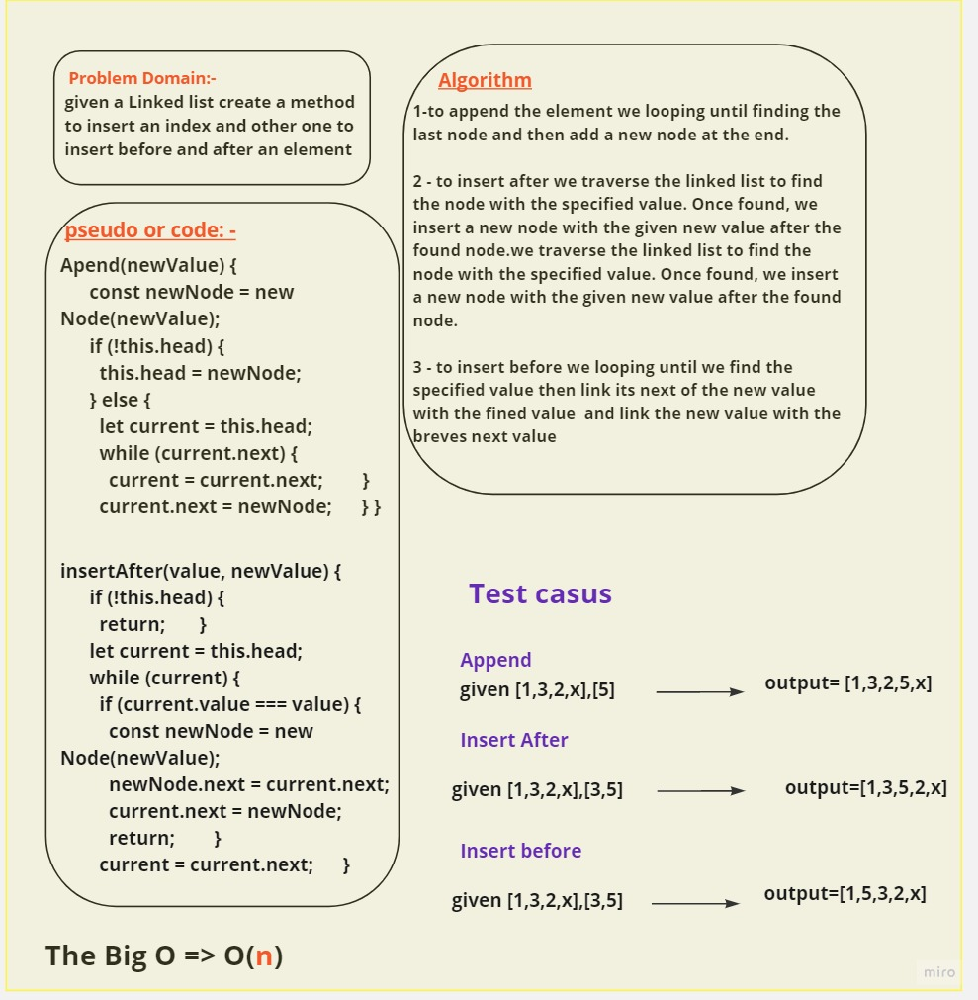

### Code Challenge: Class 06
[pull request](https://github.com/jadaan96/data-structures-and-algorithms/pull/8)

[action](https://github.com/jadaan96/data-structures-and-algorithms/actions)

Extend a Linked List to allow various insertion methods.

#### Approach & Efficiency
**Append(newValue):**
> Approach: In the append method, we traverse the linked list to find the last node and then add a new node at the end.
Time Complexity: O(n) - Since we traverse the linked list to find the last node, the time complexity is linearly proportional to the number of nodes in the linked list.
Space Complexity: O(1) - The space complexity is constant because we only allocate memory for the new node being appended.

**insertBefore(value, newValue):**

> Approach: In the insertBefore method, we traverse the linked list to find the node with the specified value. Once found, we insert a new node with the given new value before the found node.
Time Complexity: O(n) - In the worst case, we may need to traverse the entire linked list to find the specified node, resulting in a linear time complexity.
Space Complexity: O(1) - The space complexity is constant since we only allocate memory for the new node being inserted.

**insertAfter(value, newValue):**
> Approach: In the insertAfter method, we traverse the linked list to find the node with the specified value. Once found, we insert a new node with the given new value after the found node.
Time Complexity: O(n) - In the worst case, we may need to traverse the entire linked list to find the specified node, resulting in a linear time complexity.
Space Complexity: O(1) - The space complexity is constant since we only allocate memory for the new node being inserted.

### Code Challenge: Class 07
[pull request](https://github.com/jadaan96/data-structures-and-algorithms/pull/9)

[action](https://github.com/jadaan96/data-structures-and-algorithms/actions)

