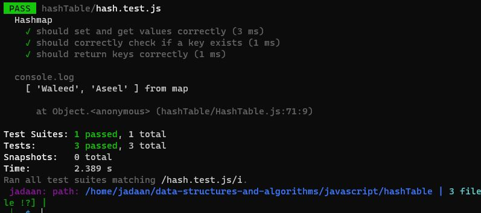

# Hash Tables

## Features

Implement a Hashtable Class with the following methods:

### `set`

- **Arguments:** `key`, `value`
- **Returns:** Nothing
- **Description:** This method should hash the `key`, and set the `key` and `value` pair in the table, handling collisions as needed. If the given `key` already exists, its value should be replaced with the `value` provided to this method.

### `get`

- **Arguments:** `key`
- **Returns:** Value associated with that `key` in the table
- **Description:** This method should return the value associated with the provided `key` in the table.

### `has`

- **Arguments:** `key`
- **Returns:** Boolean
- **Description:** This method should return a boolean value indicating whether the `key` exists in the table or not.

### `keys`

- **Returns:** Collection of keys
- **Description:** This method should return a collection of all keys present in the table.

### `hash`

- **Arguments:** `key`
- **Returns:** Index in the collection for that `key`
- **Description:** This method should calculate and return the index in the collection where the provided `key` should be stored.

## Testing

