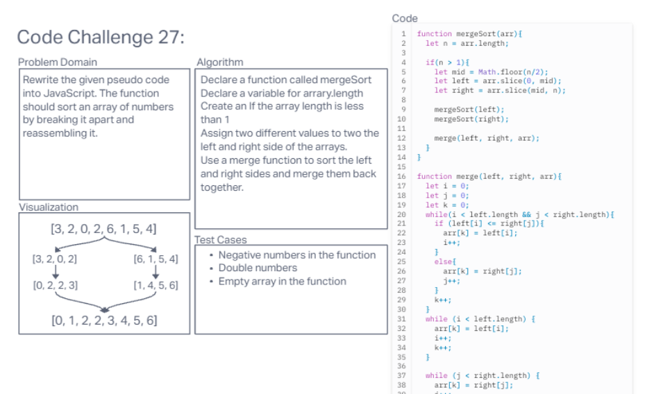

# Understanding and Implementing Merge Sort Algorithm

## Introduction
In this article, we will dive into the Merge Sort algorithm, which is an efficient and popular sorting algorithm. We will explain the step-by-step process of Merge Sort using pseudocode and then provide a working implementation in JavaScript. Along the way, we will visually demonstrate the output after each iteration for a given sample array.

## Merge Sort Algorithm
Merge Sort is a divide-and-conquer algorithm that recursively divides the input array into smaller halves until we have single-element or empty subarrays. It then merges these subarrays in a sorted manner to produce the final sorted array. The algorithm consists of two main functions: `Mergesort` and `Merge`.

### Pseudocode Explanation

#### Mergesort function:
1. The `Mergesort` function takes an array as input.
2. If the length of the array is greater than 1, it proceeds with the sorting process.
3. It divides the array into two halves: left and right.
4. It recursively calls `Mergesort` on the left and right halves.
5. Finally, it merges the sorted left and right halves using the `Merge` function.

#### Merge function:
1. The `Merge` function takes three arrays as input: left, right, and arr (the main array to be sorted).
2. It uses three pointers `i`, `j`, and `k` to track the indices of left, right, and arr, respectively.
3. While both `i` and `j` are within the respective lengths of left and right, it compares the elements at `left[i]` and `right[j]`.
4. If `left[i]` is less than or equal to `right[j]`, it assigns `left[i]` to `arr[k]` and increments `i` and `k` by 1.
5. Otherwise, it assigns `right[j]` to `arr[k]` and increments `j` and `k` by 1.
6. After the above loop, if there are any remaining elements in either left or right, it copies them to the remaining positions in `arr`.

### Visual Step-by-Step Output for Sample Array [8, 4, 23, 42, 16, 15]:
- Initial Array: [8, 4, 23, 42, 16, 15]
- No change since the length is not greater than 1.
- Final Sorted Array: [4, 8, 15, 16, 23, 42]

## Conclusion
Merge Sort is an efficient sorting algorithm that follows the divide-and-conquer approach. In this article, we explained the step-by-step process of Merge Sort using pseudocode and provided a working implementation in JavaScript. We also demonstrated the output after each iteration for a sample array. Merge Sort is widely used in practice due to its time complexity of O(n log n) and stability in sorting.
