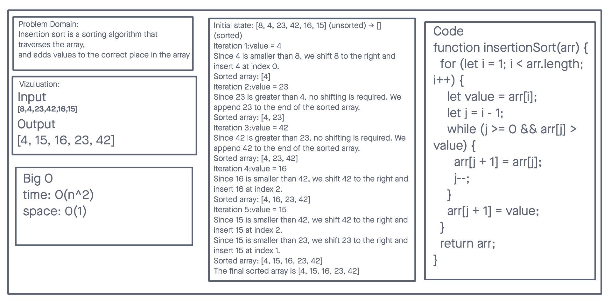

### Whiteboard Process

### Approach & Efficiency
* nitial state: [8, 4, 23, 42, 16, 15] (unsorted) -> [] (sorted)
* Iteration 1:value = 4
  - Since 4 is smaller than 8, we shift 8 to the right and insert 4 at index 0.
  - Sorted array: [4]
* Iteration 2:value = 23
  - Since 23 is greater than 4, no shifting is required. We append 23 to the end of the sorted array.
  - Sorted array: [4, 23]
* Iteration 3:value = 42
  - Since 42 is greater than 23, no shifting is required. We append 42 to the end of the sorted array.
  - Sorted array: [4, 23, 42]
* Iteration 4:value = 16
  - Since 16 is smaller than 42, we shift 42 to the right and insert 16 at index 2.
  - Sorted array: [4, 16, 23, 42]
* Iteration 5:value = 15
  - Since 15 is smaller than 42, we shift 42 to the right and insert 15 at index 2.
  - Since 15 is smaller than 23, we shift 23 to the right and insert 15 at index 1.
  - Sorted array: [4, 15, 16, 23, 42] The final sorted array is [4, 15, 16, 23, 42]