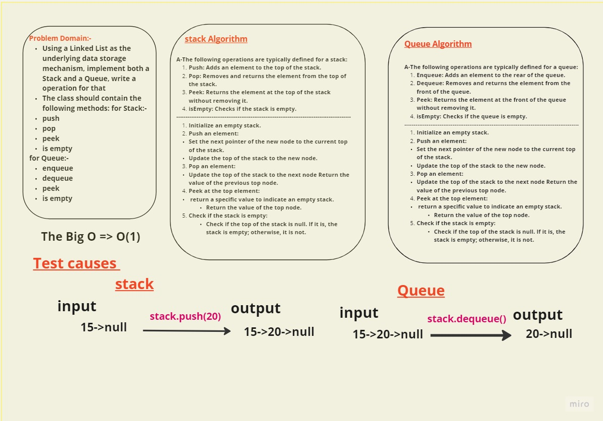

### Stack:

* Approach: Use a singly linked list to implement the stack.
* Push operation: Add an element to the top of the stack. Time complexity: O(1).
* Pop operation: Remove and return the element from the top of the stack. Time complexity: O(1).
* Peek operation: Return the element at the top of the stack without removing it. Time complexity: O(1).
* isEmpty operation: Check if the stack is empty. Time complexity: O(1).
* Space complexity: O(1) as it depends on the number of elements stored.

### Queue:

* Approach: Use a singly linked list to implement the queue.
* Enqueue operation: Add an element to the rear of the queue. Time complexity: O(1).
* Dequeue operation: Remove and return the element from the front of the queue. Time complexity: O(1).
* Peek operation: Return the element at the front of the queue without removing it. Time complexity: O(1).
* isEmpty operation: Check if the queue is empty. Time complexity: O(1).
* Space complexity: O(1) as it depends on the number of elements stored.